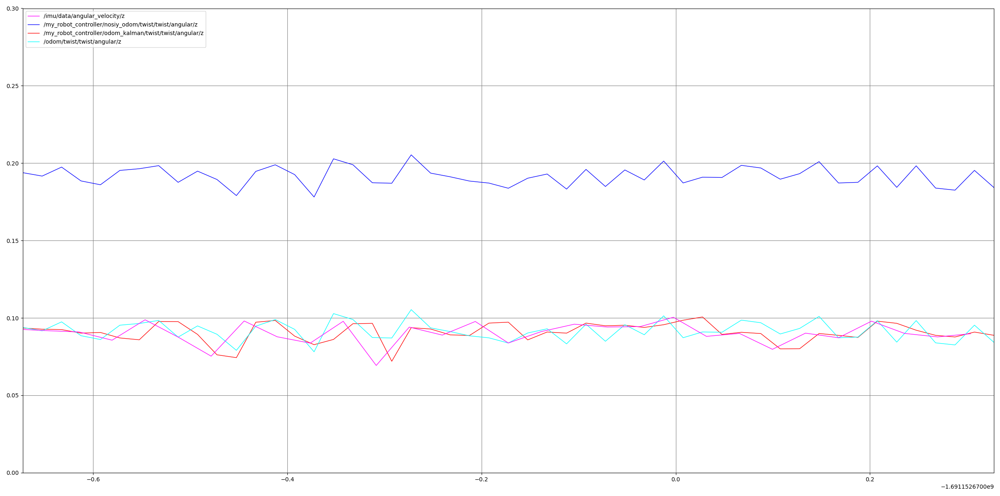

# ros2_urdf_diff_drive
# Controller Node


## Description

The `Controller` node is a ROS2 node that publishes to the `/cmd_vel` and `/set_joint_trajectory` topics at a certain frequency. This node is designed to control a robot's velocity and joint trajectory.

# URDF Robot Description

my_robot.urdf (Unified Robot Description Format) file that describes a simple robot with a base and wheels.

## Robot Description

The robot consists of the following components:

1. `base_footprint`: A virtual link representing the base footprint.
2. `base_link`: The main body of the robot, represented as a box with dimensions `base_length`, `base_width`, and `base_height`.
3. `right_wheel_link` and `left_wheel_link`: The right and left wheels of the robot, represented as cylinders with radius `wheel_radius` and length `wheel_length`.
4. `caster_wheel_link`: A caster wheel represented as a sphere with radius `wheel_radius / 2.0`.

# URDF Robot Description

arm.urdf (Unified Robot Description Format) file that describes a simple robot with an arm, forearm, and hand.

## Robot Description

The robot consists of the following components:

1. `arm_base_link`: The base link of the robot arm, represented as a box with dimensions `arm_base_length`, `arm_base_width`, and `arm_base_height`.
2. `forearm_link`: The forearm link, represented as a cylinder with radius `cylinder_radius` and length `cylinder_length`.
3. `hand_link`: The hand link, represented as a cylinder with radius `cylinder_radius` and length `cylinder_length`.

## Parameters

The robot has the following parameters defined using `xacro` properties:

- `arm_base_length`: The length of the arm base (default: 0.1).
- `arm_base_width`: The width of the arm base (default: 0.1).
- `arm_base_height`: The height of the arm base (default: 0.02).
- `cylinder_radius`: The radius of the forearm and hand links (default: 0.02).
- `cylinder_length`: The length of the forearm and hand links (default: 0.3).

# KalmanFilter

The `KalmanFilter` class is a C++ implementation of the Kalman filter algorithm. It subscribes to Odometry and IMU messages, performs state prediction and measurement update steps, and publishes the filtered Odometry message.

## Dependencies

- `rclcpp`
- `nav_msgs`
- `sensor_msgs`

## Installation

1. Make sure you have ROS2 installed.
2. Clone this repository to your ROS2 workspace:

```bash
cd /path/to/your/ros2_workspace/src
git clone https://github.com/Keshavraj024/ros2_urdf_diff_drive.git
```

3. Build the package:

```bash
cd /path/to/your/ros2_urdf_diff_drive
colcon build
```

## Usage

To run, use the following command:

```bash
ros2 launch my_robot_bringup my_robot_gazebo.launch.xml 
```
In the image shown 
The image showcases a visual representation of different pose estimate lines using various sensors. The red line, known as "kalman_odom," demonstrates a smooth and accurate pose estimation obtained through a Kalman filter. The blue line, labeled "noisy_odom," portrays a pose affected by noise or uncertainty, resulting in a less precise pose. The pink line represents "imu_measurement," indicating the pose was derived from Inertial Measurement Unit data for measurement update. Lastly, the green line represents "odom_groundtruth," signifying the ground truth pose obtained from odometry data, representing the most accurate pose among the lines depicted in the image.

